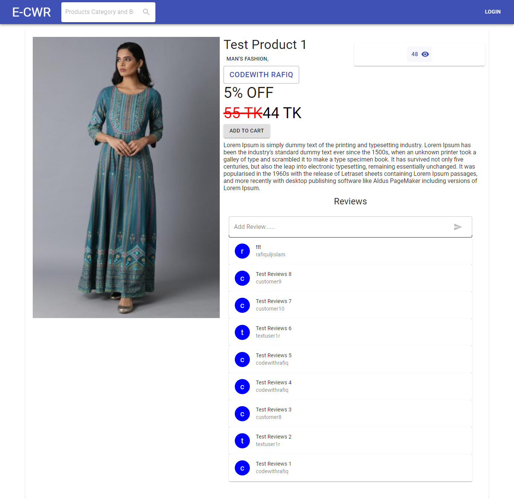
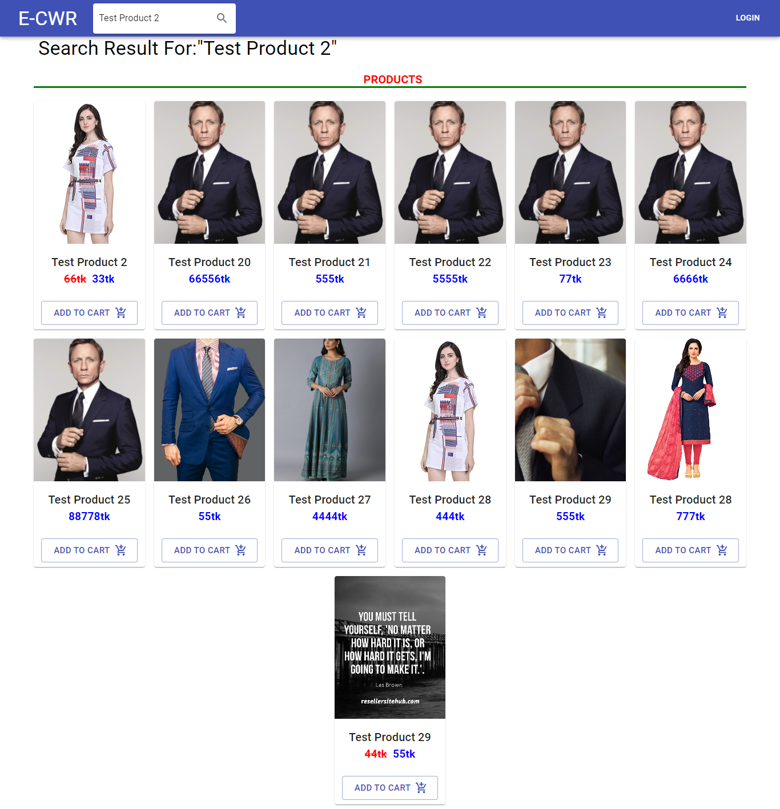
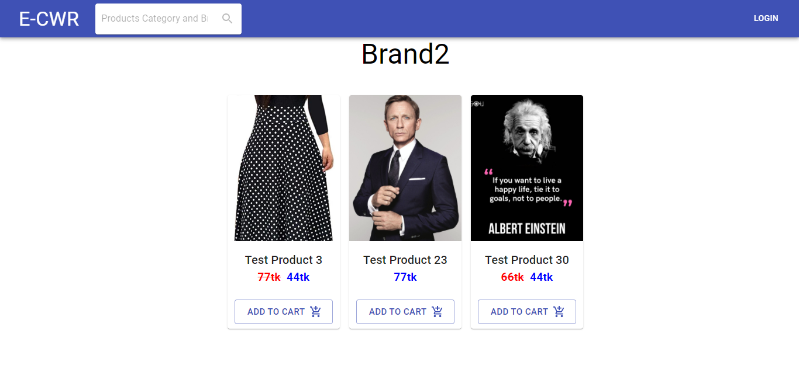
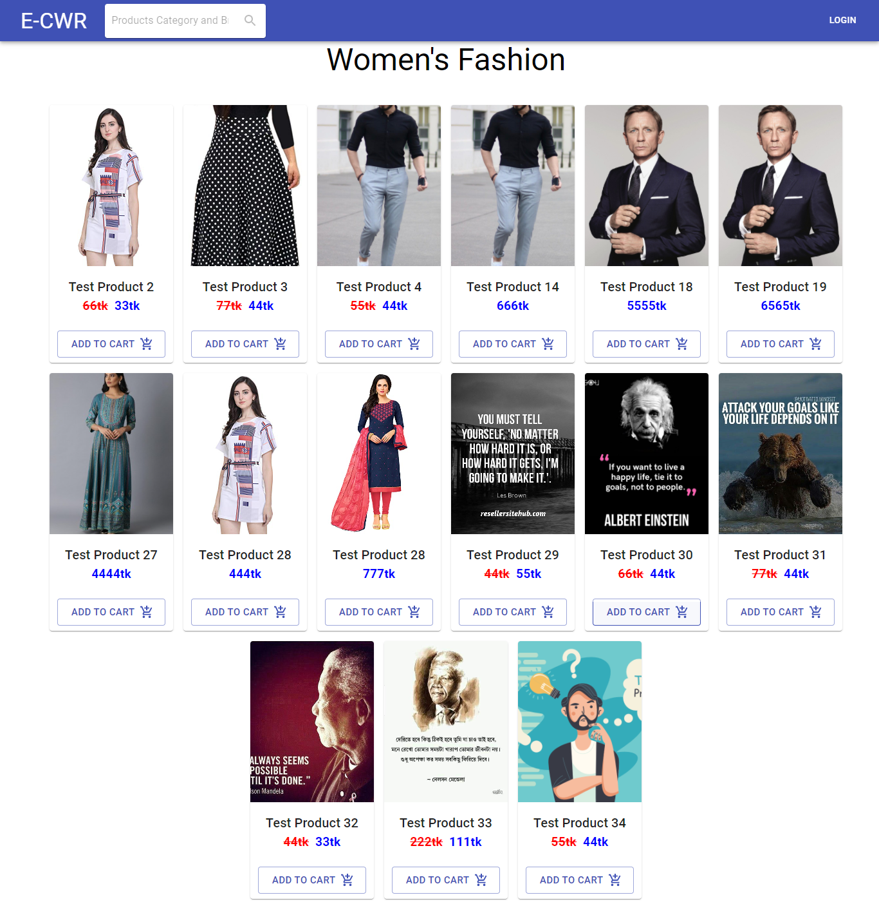
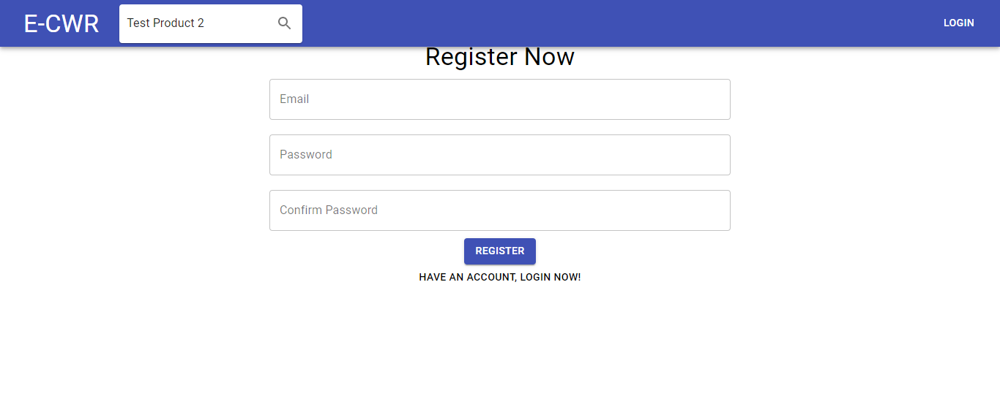
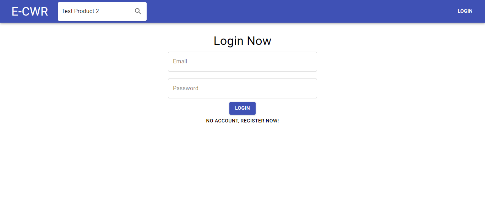

# Django Reactjs Online Shopping App

## [Full Project in Video](https://www.youtube.com/playlist?list=PLsC9YeVUTz39OEEoFhHrPNuK62Jcn43yL)

### Technology Use

- Django Rest API
- React js
- Material ui

## Home Page

## Product Details Page

## Search Result Page

## Single Brand Page

## Single Category Page

## Register New User Page

## Login Page

